# Cwiczenie 5

## Cel
Zapoznanie się z grafana hosting jako alternatywą rozwiązania "self hosting".

## Wprowadzenie
Tak jak większość produktów dostępna do pobrania i instalaji na własnej infrastrukturze czy to w firmie czy prywatnie, Grafana serwis oferuje możliwość uruchomienia systemu zdalnie bez konieczności pobierania i instalowania czego kolwiek. Takie rozwiązanie posiada szereg zalet oraz jest wygodne. Czemu? Myślę, że na odpowieź wpadniecie sami wraz z zakończeniem poniższego laboratorium.

## Elementy laboratorium

Tu znajdziecie ogólny zarys wymagań oraz elementów ćwiczenia:

| Identyfikator | Mail                    | Hasło       | link instancji                  |
|---------------|-------------------------|-------------|---------------------------------|
| crcdevops01   | crcdevops01@gmail.com   | crc2019PWR# | https://crcdevops01.grafana.net |
| crcdevops02   | crcdevops02@gmail.com   | crc2019PWR# | https://crcdevops02.grafana.net |
| crcdevops03   | crcdevops03@gmail.com   | crc2019PWR# | https://crcdevops03.grafana.net |
| crcdevops04   | crcdevops04@gmail.com   | crc2019PWR# | https://crcdevops04.grafana.net |
| crcdevops05   | crcdevops05@gmail.com   | crc2019PWR# | https://crcdevops05.grafana.net |
| crcdevops06   | crcdevops06@gmail.com   | crc2019PWR# | https://crcdevops06.grafana.net |
| crcdevops07   | crcdevops07@gmail.com   | crc2019PWR# | https://crcdevops07.grafana.net |
| crcdevops08   | crcdevops08@gmail.com   | crc2019PWR# | https://crcdevops08.grafana.net |
| crcdevops09   | crcdevops09@zoho.eu     | crc2019PWR# | https://crcdevops09.grafana.net |
| crcdevops10   | crcdevops10@interia.pl  | crc2019PWR# | https://crcdevops10.grafana.net |
| crcdevops11   | crcdevops11@interia.pl  | crc2019PWR# | https://crcdevops11.grafana.net |
| crcdevops12   | crcdevops12@interia.pl  | crc2019PWR# | https://crcdevops12.grafana.net |
| crcdevops13   | crcdevops13@interia.pl  | crc2019PWR# | https://crcdevops13.grafana.net |
| crcdevops14   | crcdevops14@interia.pl  | crc2019PWR# | https://crcdevops14.grafana.net |
| crcdevops15   | crcdevops15@interia.pl  | crc2019PWR# | https://crcdevops15.grafana.net |
| crcdevops16   | crcdevops16@interia.pl  | crc2019PWR# | https://crcdevops16.grafana.net |
| crcdevops17   | crcdevops17@interia.pl  | crc2019PWR# | https://crcdevops17.grafana.net |
| crcdevops18   | crcdevops18@interia.pl  | crc2019PWR# | https://crcdevops18.grafana.net |
| crcdevops19   | crcdevops19@interia.pl  | crc2019PWR# | https://crcdevops19.grafana.net |
| crcdevops20   | crcdevops20@interia.pl  | crc2019PWR# | https://crcdevops20.grafana.net |

Każdemu uczestnikowi szkolenia został przyporządkowany numer od 1-20. Zgodnie z przypisanym numerem odszukaj go w tabeli po czym w przeglądarce firefox otwórz:

https://grafana.com/

W prawym górnym rogu klikamy "Login":<br/>
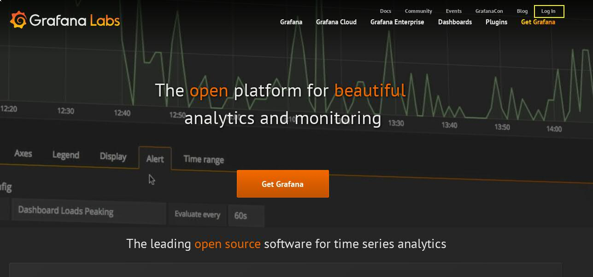

Kolejno posługując się danymi z tabeli 1 przy założeniu, że pamietamy swój numer wpisujemy:<br/>
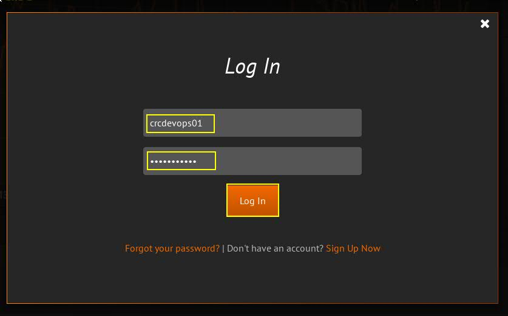

Po zalogowaniu się do portalu klikamy "Personal":<br/>


Kolejno jeszcze raz "Personal":<br/>
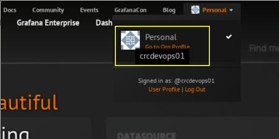

Obok "Hosted Grafana" klikamy "Details":<br>
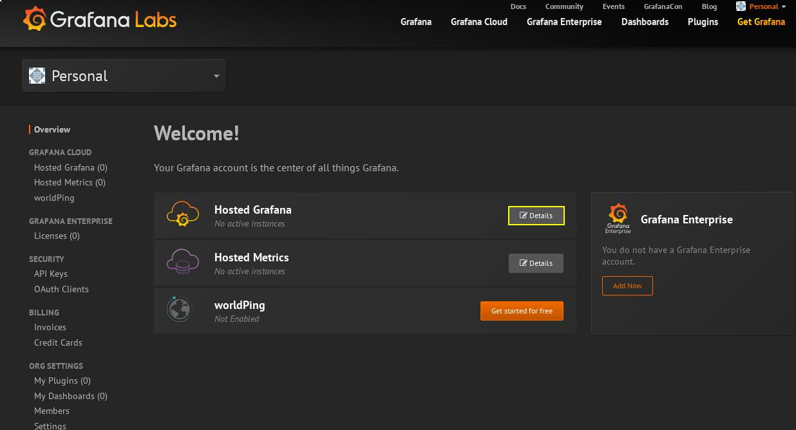

Następnie "Create Hosted Grafana instance":<br>
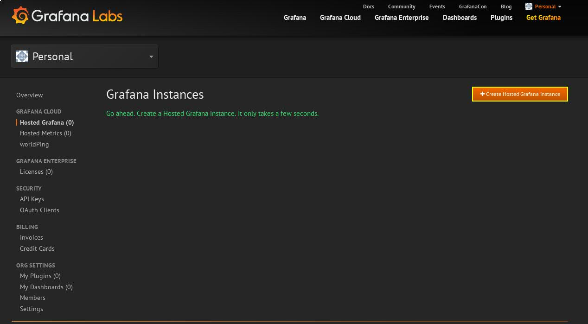

Jak widać jest to darmowa instancja o bardzo okrojonych możliwościach.


Wcześniej możemy jeszcze raz się upewnić, że za nic nie zapłacimy: )
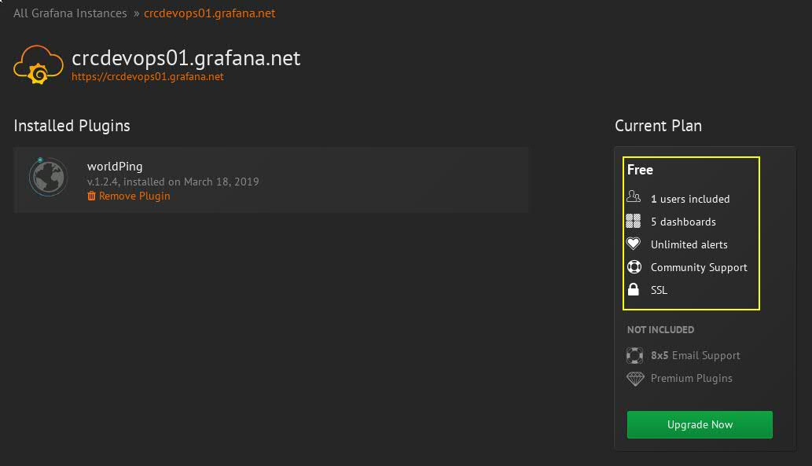

Aby zlogować się do grafany należy kliknąć uprzednio poniżej zaznaczony link:<br>
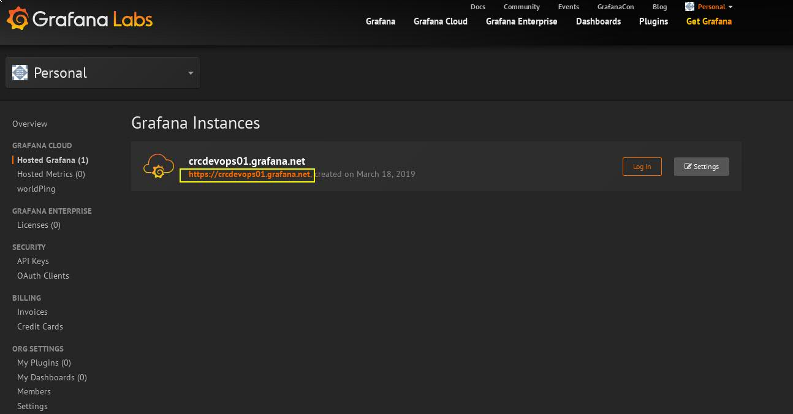

Zostaniemy zautoryzowani za pomocą konta na grafana.com i system zaloguje nas do zewnętrznej instancji grafany:<br/>
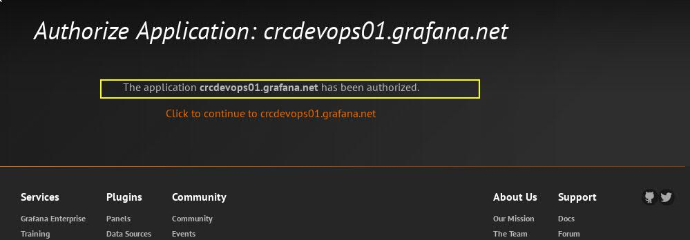

`Poniższe punkty cwiczenia nie są obowiązkowe (dla chętnych). Nie mniej jednak zachęcam Was do jego wykonania. Dzięki temu nabierzecie wprawy w tworzeniu grafów oraz dashboardów.`

Podpinamy testowe źródło danych:</br>
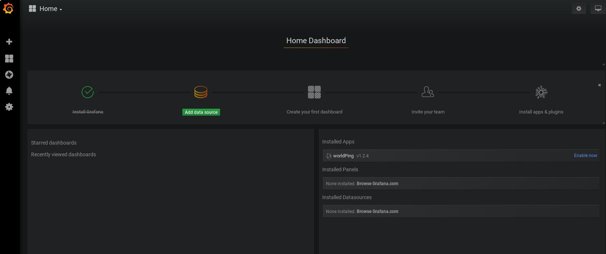

Jako źródło wybieramy testowe dane systemu grafana:<br/>
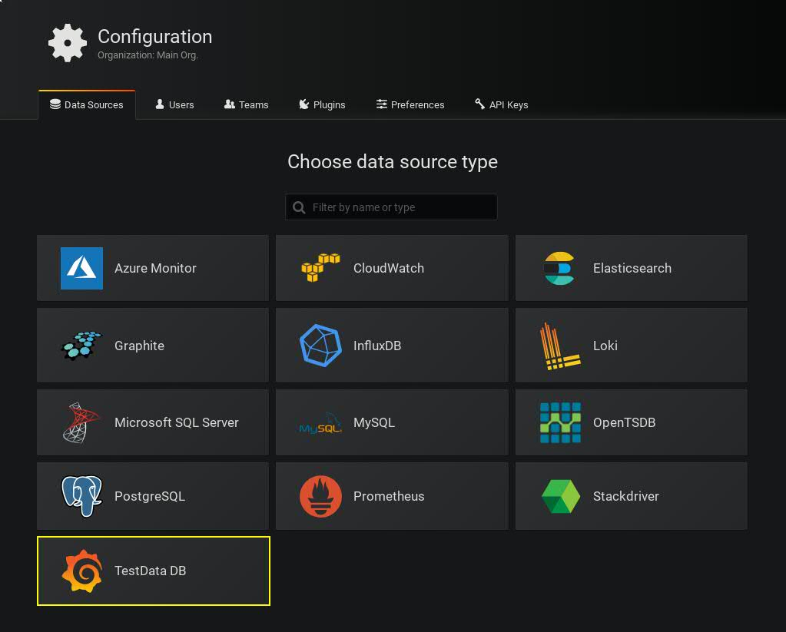

Nadajemy mu nazwę: "CrcTestData":<br/>


Zapisujemy oraz testujemy źródło danych:</br>
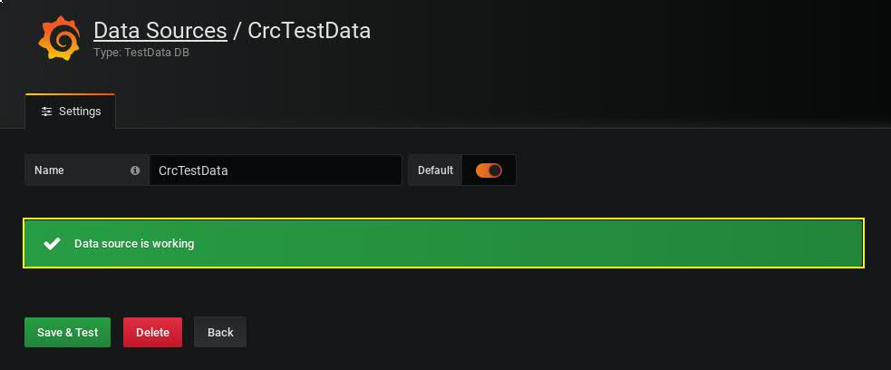

Cloud hosting wystawia najnowszą dostępną wersje grafany, która nieco różni się od naszej zainstalowanej w SoftLayer. Nie są to aż tak drastyczne zmiany więc można bardzo szybko się przestawić.

Postępuj zgodnie ze strzałkami oraz przypisaną numeracją:<br/>


By móc wizualizować przykładowe dane należy uzupełnić 4 przykładowe zapytania.
```
A: 10,11,20,5,7,4,12,21,-2,-10,10,15,16,-2,-11
B: -1,-2,-5,-9,10,11,1,0,12,-11,-5,6,10,11,2,-9
C: -1,-2,-3,-4,-6,-11,-12,-10,-20,-4,-5,-7,-8,-7,-10
D: 3,2,5,7,8,7,3,1,5,4,10,11,-2,-7,-5,-10,-11,-5,10
```

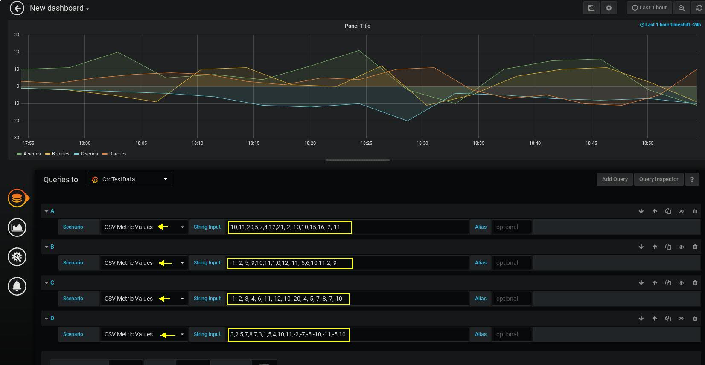

Klikamy "Visualization" w celu wybrania szaty graficznej dla naszego grafu:<br/>
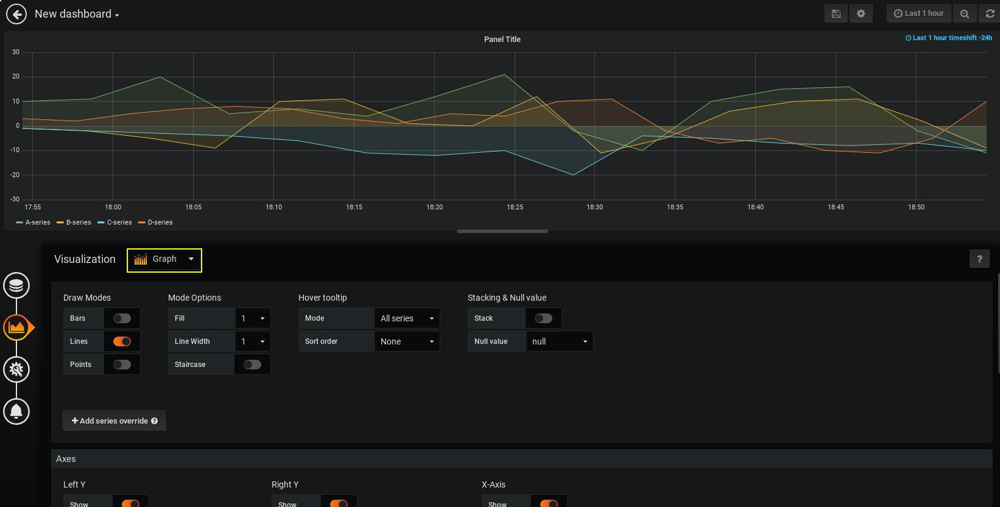

Z racji iż będziemy prezentować przykładowe temperatury wykorzystamy wbudowany template "Heatmap":<br/>


Definiujemy właściwą jednostkę oraz minimalną i maksymalną wartość dla osi Y:<br/>
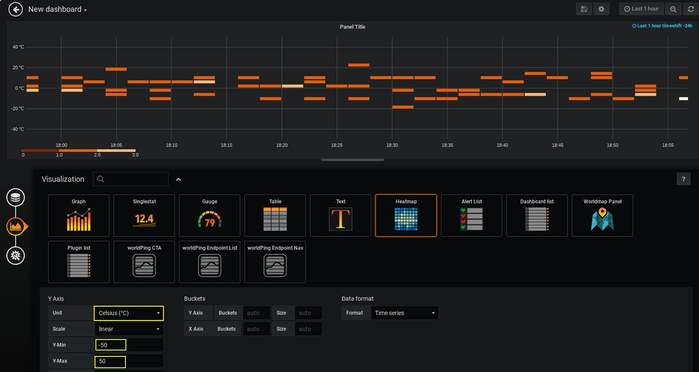

Pozostatło nam jeszcze ustawienie tytułu oraz krótiego opisu:<br/>
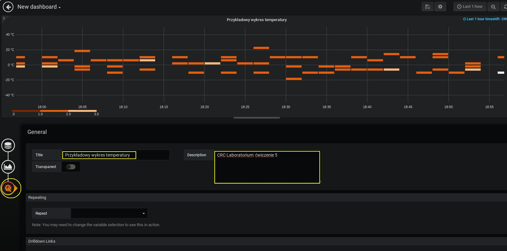

Zapisujemy nasz dashboard:<br/>


W katalogu "General" pod nazwą: CRC - cwiczenie 5(wykres temperatuy):<br/>
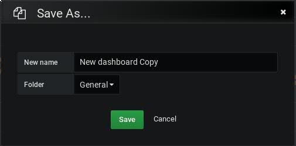

Dashboard powinien być już widoczny:<br/>
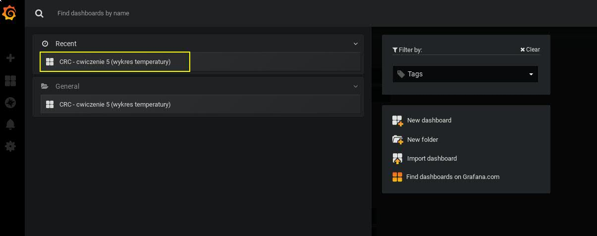

Powinien wyglądać mniej więcej tak:<br/>


Ustalamy krótki opis oraz dodajemy kilka znaczników:<br/>
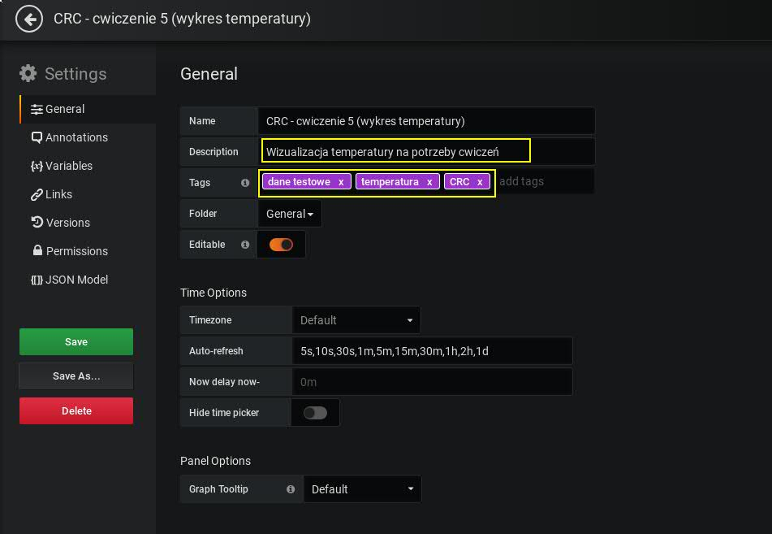

Po kliknięciu save powinien pojawić się zielony "popup":<br/>
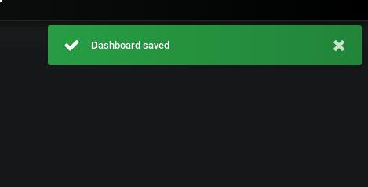

Jak widzimy nasz dashboard posiada opis oraz zestaw znaczników, które służą jako świetna alternatywa etykiet! Przy dużej liczbie dashboardów pozwala wyszukiwać to co nas interesuje.<br/>
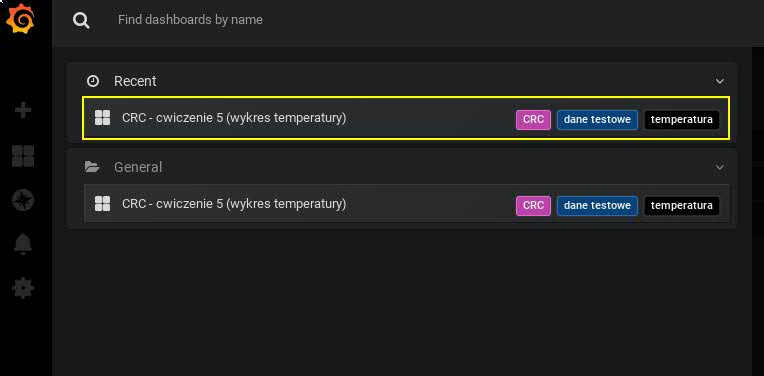

### Jeżeli z jakiegoś powodu nie byłeś w stanie wykonać części nieobowiązkowej ćwiczenia. Nic straconego. Możesz wczytać dashboard. Znajduje się w katalogu "wczytaj". Dokłade informacje jak wczytywać dashboardy znajdziecie w cwiczeniu 3.
